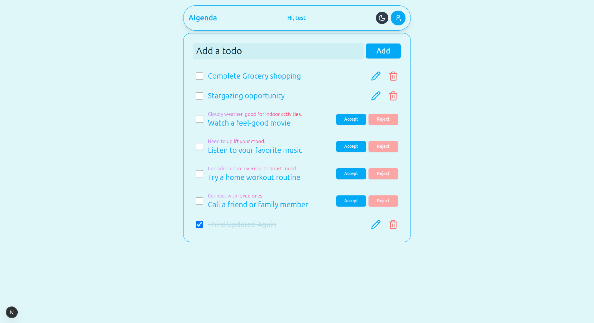

# 🧠 AIgenda – Smart Todo App

A smart todo app powered by AI suggestions, real-time location awareness, weather context, and mood input. Plan your day smarter with AIgenda.

 <!-- Replace with actual path -->

---

## ✨ Features

- ✅ Manage todos with simple UX (add, complete, delete)
- 🤖 AI-powered suggestions based on:
  - Current todos
  - Location (via Geolocation API)
  - Weather (OpenWeatherMap)
  - Mood input (How’s your day?)
- 📍 Auto Location detection
- 🔐 Authentication using `next-auth`
- 💄 Beautiful UI with `shadcn/ui` and TailwindCSS
- ⚡ State management via `zustand`

---

## 🧱 Built With

- **Next.js** – Fullstack React Framework
- **Zustand** – Lightweight global state manager
- **NextAuth.js** – Authentication
- **@google/genai** – Generate intelligent suggestions
- **Shadcn/UI** – Modern and accessible UI components
- **OpenWeatherMap API** – Context-aware suggestions based on current weather

---

## 🚀 Getting Started

### 1. Clone the repo

```bash
git clone https://github.com/vallabhtiwari/aigenda.git
cd aigenda
```

### 2. Install dependencies

```bash
pnpm install
```

### 3. Set up environment variables

```bash
DATABASE_URL="xxxx"
NEXTAUTH_URL=http://localhost:3000
NEXTAUTH_SECRET=xxxx
GEMINI_API_KEY="xxxx"
GEMINI_MODEL="model-name"
OPENWEATHERMAP_API_KEY="xxxx"
```

### 5. Intialize db

```bash
pnpm prisma migrate dev
```

### 6. Run the development server

```bash
pnpm prisma migrate dev
```
